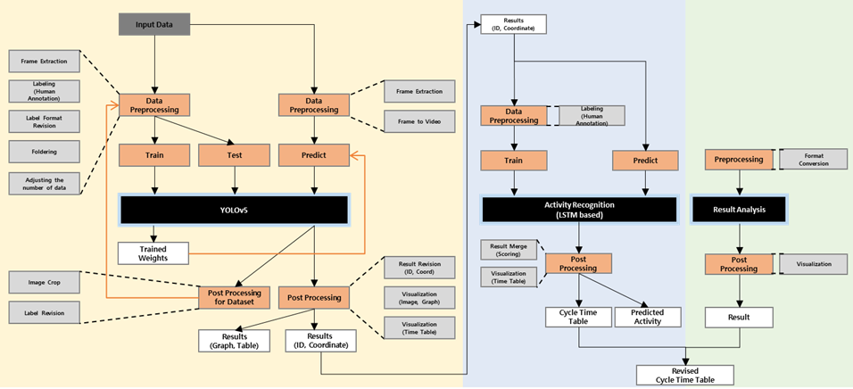

<div id="top"></div>

<!-- TABLE OF CONTENTS -->
<details>
  <summary>Table of Contents</summary>
  <ol>
    <li>
      <a href="#about-the-project">About The Project</a></li>
    <li>
      <a href="#getting-started">Getting Started</a></li>
    <li>
      <a href="#process">Usage</a></li>
    <li>
      <a href="#usage">Usage</a></li>
    <li>
      <a href="#architecture">Architecture</a></li>
  </ol>
</details>


<!-- ABOUT THE PROJECT -->
## About The Project
* Obayashi project code 
<p align="right">(<a href="#top">back to top</a>)</p>

<!-- GETTING STARTED -->
## Getting Started

follow [README](https://github.com/separk-1/proj_OBYS/blob/main/README.ipynb)


[](https://colab.research.google.com/github/separk-1/proj_OBYS/blob/main/README.ipynb)

### 1. Installation

#### 1) Clone the repo
   ```sh
   git clone https://github.com/separk-1/proj_OBSYS.git
   ```
#### 2) Install packages
   ```sh
   pip install -r requirements.txt  
   ```
   
### 2. Process
#### Yaml file and Execution file
* Since the file path or variables are defined in the yaml file, you need to set the variables when you use the system.
* You can choose the mode for each system through execution bin file.


<p align="right">(<a href="#top">back to top</a>)</p>

<!-- USAGE EXAMPLES -->
## Usage
### 0. Dataset
* raw_data
* case_data: 
  - case_data
  - case_data_threshold
* test_data
* activity_recognition


### 1. DataPreprocessing
<p align="center"></p>

#### 1) mode: Video to Frame
* Input file: Original video
* Output file: Images by Frame
```sh
python Run_Datapreprocessing.py -mode Video_to_frame
```


#### 2) mode: Frame to Video
* Input file: Images by Frame
* Output file: Converted Video
```sh
python Run_Datapreprocessing.py -mode Frame_to_video
```


#### 3) mode: Format Revision
* Input file: Original labels, images set
* Output file: Overlap files removed
```sh
python Run_Datapreprocessing.py -mode FormatRevision
```


#### 4) mode: Foldering
* Input file: labeled train/validation dataset
* Output file: Foldered dataset
```sh
python Run_Datapreprocessing.py -mode Foldering
```


#### 5) mode: Foldering Random
* Input file: foldered dataset
* Output file: evenly distributed dataset
```sh
python Run_Datapreprocessing.py -mode Foldering_Random
```


### 2. Object Detection
<p align="center"></p>
#### 1) mode: Training
* Input file : Train dataset , Pre-trained model(weights)
* Setting condition : batch size, epoch
* Output file : Custom trained model(weights)
```sh
python object_detection.py -mode training
```

#### 2) mode: Prediction
* Input file : Test video, Custom pre-trained model(weights)
* Setting condition : confidence threshold
* Output file : prediction result(pkl file)
```sh
python object_detection.py -mode prediction
```

#### 3) mode: Postprocessing
* Input file : Prediction result(pkl file)
* Output file : Revised prediction result(ID and Coordinate csv files)
```sh
python object_detection.py -mode postprocessing
```

### 3. Activity Recognition
<p align="center"></p>

#### 1) mode: Training
* Input file : Csv format file for training
* Setting condition : step size, hidden layer, batch size, epoch
* Output file : Trained model(weights)
```sh
python activity_recognition.py -mode training
```

#### 2) mode: Predicting
* Input file : Csv format file, Pre-trained model(weights)
* Setting condition : step size, hidden layer, batch size, epoch
* Output file : Csv format file with prediction
```sh
python activity_recognition.py -mode predicting
```


### 4. Result Analysis
<p align="center"></p>

#### 1) mode: Time Table
* Input file : Activity predicted ID file
* Setting condition : time interval
* Output file : Time Table(Activity & Equipment)
```sh
python python result_analysis.py --mode time_table
```

#### 2) mode: Cycle Time
* Input file : Activity predicted ID file
* Setting condition : Activity Classes
* Output file : Activity Cycle Time
```sh
python python result_analysis.py --mode cycle_time
```

#### 3) mode: counting dump_truck and payloader 
* Input file : Activity predicted ID and Coordinate file
* Output file : Number of countings 
```sh
python result_analysis.py --mode counying_dumptruck 
```

<p align="right">(<a href="#top">back to top</a>)</p>


<!-- Architecture -->
## Architecture


<p align="right">(<a href="#top">back to top</a>)</p>
